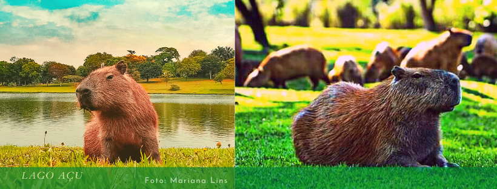
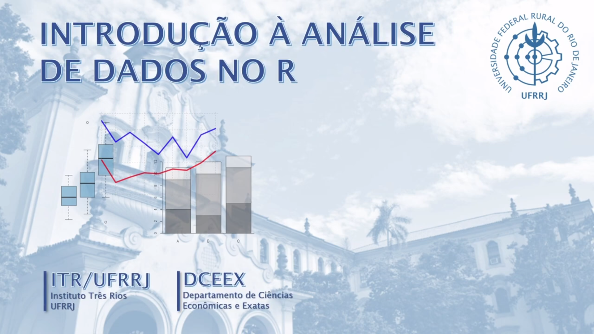

```{r setup, include=FALSE}
library(knitr)

## Global options
options(max.print="75")
knitr::opts_chunk$set(echo=FALSE,
               cache=TRUE,
               prompt=FALSE,
               tidy=TRUE,
               comment=NA,
               message=FALSE,
               warning=FALSE,
               cache.lazy=FALSE)
knitr::opts_knit$set(width=75)

```


<!-- ```{r klippy} -->
<!-- # Insert copy to clipboard buttons in HTML documents -->
<!-- # remotes::install_github("rlesur/klippy") -->
<!-- klippy::klippy( -->
<!--   lang = c("r", "markdown"), -->
<!--   all_precode = FALSE, -->
<!--   position = c("top", "right"), -->
<!--   color = "navyblue", -->
<!--   tooltip_message = "copiar código", -->
<!--   tooltip_success = "copiado!" -->
<!-- ) -->

<!-- ``` -->


```{css echo=FALSE}
/* Define a margin before h2 element */
h2  {
  margin-top: 4em;
}

/* Define a margin after every first p elements */
p:first-of-type {
  margin-bottom: 2em;
}
``` 


```{r}
## Color Format
colFmt <- function(x,color) {
  
  outputFormat <- knitr::opts_knit$get("rmarkdown.pandoc.to")
  
  if(outputFormat == 'latex') {
    ret <- paste("\\textcolor{",color,"}{",x,"}",sep="")
  } else if(outputFormat == 'html') {
    ret <- paste("<font color='",color,"'>",x,"</font>",sep="")
  } else {
    ret <- x
  }

  return(ret)
}

```


```{r echo=F, fig.align="center", message=FALSE, warning=FALSE, comments=NA, out.width="90%", comment=NA}


```

## Professores:

- Adriana Andrade (DEMAT/ICE/UFRRJ) (*andrade.ufrrj@gmail.com*)

- Wagner Tassinari (DEMAT/ICE/UFRRJ) (*tassinari@ufrrj.br*)


# Informações Gerais

## Objetivo da Disciplina

Apresentar uma visão geral dos principais modelos de regressão. A
disciplina se inicia com uma breve apresentação sobre manipulação de
bases de dados e análise exploratória, seguida por uma introdução sobre
modelagem estatística. Serão abordados aspectos da modelagem de
Regressão Linear, simples e múltipla, técnicas de predição pontual e
intervalar, bem como análise da adequação e da qualidade do modelo. A
disciplina inclui uma introdução aos Modelos de Regressão Generalizados,
com a apresentação dos Modelos de Regressão Logística e o Modelo
Poisson.

## Formato da Disciplina

- O curso será composto de atividades **síncronas** (são atividades baseadas em encontros remotos professor-alunos de forma on line) e de atividades **assíncronas** (são atividades que poderam ser feitas pelos alunos sem a presença do professor, por exemplo: Leitura do material bibliográfico, videoaulas, listas de exercícios e etc). As aulas síncronas serão feitas via plataforma *Google Meet* durante o horário original da disciplina. Os dias das aulas síncronas estão indicadas na tabela abaixo contendo o cronograma do curso. O link para o acesso as aulas síncronas, estará disponível no sistema SIGAA/UFRRJ no tópico do primeiro dia de aula.

## Sobre o pacote estatístico R 

- Neste curso também está previsto a utilização do **pacote estatístico R** utilizando a interface gráfica do **RStudio**. O pacote estatístico R, que pode ser encontrado no site oficial do projeto CRAN ([link](https://cran.r-project.org/)). O pacote estatístico R é uma linguagem de programação estatística e gráfica direcionada para a manipulação, visualização e análise estatística de dados, que atualmente vem sendo considerada uma das melhores ferramentas para essa finalidade. A linguagem ainda possui como diferencial a facilidade no aprendizado, mesmo para aqueles que nunca tiveram contato anterior com programação. O pacote estatístico R é um *software* livre (*free*) e de código aberto (*open source*) para análise de dados.

\vspace{0.3mm}

- Uma das formas de utilizar a linguagem R é através da interface gráfica **RStudio** ([link](https://rstudio.com/products/rstudio/)), que é uma IDE ou ambiente de desenvolvimento integrado, para o pacote R. Com sua utilização gratuita, o RStudio é uma excelente ferramenta para trabalhar com o R. Essa plataforma é extremamente visual quando comparado com ambientes de outras linguagens e também com o console do R, e muito simples de se utilizar.

# Curso Extensão - Introdução à Análise de Dados no R

```{r echo=F, fig.align="center", message=FALSE, warning=FALSE, comments=NA, out.width="40%", comment=NA}

```

Este é um curso de extenção ministrado pelos professores Diógenes Ferreira Filho e Manuel Francisco de Souza Pereira do DCEEX/IRT/UFRRJ.
Neste curso é abordado desde a instalação do pacote estatístico R e da interface RStudio, análises básicas utilizando o R até o ambiente do universo do tidyverse e RMarkdown.

As videoaulas encontram-se disponíveis de forma aberta neste [canal do YouTube]( https://youtube.com/channel/UCRc5HRkgnq8swWSAUywDd5w).


# Programa da Disciplina

| Tópicos | Conteúdo                                         |
| ------- | ------------------------------------------------ |
| **1.**   | **Análise Exploratória de Dados com software R** |
|         |                                                  |
| **2.**   | **Modelo de Regressão Linear Simples**           |
| **2.1.** | Estimação dos Parâmetros                         |
| **2.2.** | ANOVA da Regressão                               |
| **2.3.** | Intervalo de Confiança e de Predição             |
| **2.4.** | Adequação do Ajuste                              |
|         |                                                  |
| **3.**   | **Regressão Linear Múltipla**                    |
| **3.1.** | Estimação dos Parâmetros                         |
| **3.2.** | Métodos de Seleção de Modelos                    |
| **3.3.** | Adequação do Ajuste                              |
| **3.4.** | Variáveis Dummy                                  |
|         |                                                  |
| **4.**   | **Modelo de Regressão Logística**                |
| **4.1.** | Estimação dos Parâmetros do Modelo               |
| **4.2.** | Interpretação do Modelo                          |
| **4.3.** | Avaliação da Qualidade do Modelo                 |
|         |                                                  |
| **5.**   | **Modelo de Regressão de Poisson**               |
| **5.1.** | Estimação dos Parâmetros do Modelo               |
| **5.2.** | Interpretação do Modelo                          |
| **5.3.** | Avaliação da Qualidade do Modelo                 |


# Avaliação da Disciplina

- Seminário – 10/12/2021 

**Obs:** Os seminários deverão ser feitos segundo as seguintes orientações: [link](https://drive.google.com/file/d/16Zm_795nPZHt888ZlrNv1QMw4zlCk_cD/view?usp=sharing)

# Bibliografia

-  Dohoo, I. R., Martin, W., & Stryhn, H. E. (2003). Veterinary epidemiologic research.

- Dobson , AJ (2001). An introduction to generalized linear models.
Chapman & Hall/CRC.

- Faraway, J. Practical Regression and Anova using R (PDF, banco de
dados e scripts disponível no site [link](https://julianfaraway.github.io/faraway/PRA/pra.pdf))

- Fox, J (2002). An R and S-Plus Companion to Applied Regression. Sage
Publications.

- McCullagh P, Nelder JA (1989). Generalized linear models. Second
Edition. Chapman and Hall.

- Myers, Raymond H. et al. (2012) Generalized linear models: with
applications in engineering and the sciences. John Wiley & Sons.

- Venables WN, Ripley, BD (2002). Moderns Applied Statistics with S.
Fourth Edition. Springer.


# Cronograma dos encontros síncronos

- Todos os encontros síncronos serão às sextas-feiras a partir das 9hs.

|    Data    | Aula |                             Descrição                             |
|:----------:|:----:|:-----------------------------------------------------------------:|
| 05/11/2021 |   1  | Introdução do curso + Revisão Análise Exploratória de Dados (AED) |
| 12/11/2021 |   2  | Modelo de Regressão Simples                                       |
| 19/11/2021 |   3  | Modelo de Regressão Múltipla                                      |
| 26/11/2021 |   4  | Modelo de Regressão Logística                                     |
| 03/12/2021 |   5  | Modelo de Regressão de Poisson                                    |
| 10/12/2021 |   6  | Apresentação dos Seminários                                       |


# **Aula 1: Revisão Análise Exploratória de Dados (AED)**

- Nessa aula síncrona será apresentado esse novo formato da disciplina (conteúdo e dinâmica das aulas). 

- Revisão sobre o conteúdo de análise exploratória de dados.

- Não está prevista atividade assíncrona para esta aula.


| Atividades |             Tipo de atividades            |        Links                          |
|:----------:|:-----------------------------------------:|:---------------------------------------:|
|  Síncrona  | Atividades síncronas a respeito da Aula 1 - Parte 1 | [link](Aula1/AED.html) |
|  Síncrona  | Atividades síncronas a respeito da Aula 1 - Parte 2 |  [link](Aula1/AED2.html)  |
|  Síncrona  | Banco de dados **daisy2.xlsx**                       | [link](https://drive.google.com/file/d/1nwylCqb4_gFkch4sPBYHIajlCoQ0VQAz/view?usp=sharing) |
|  Síncrona  | Link para a sala de videoconferência **dia 05/11/2021 (sexta-feira) às 9hs**  |  [link](https://meet.google.com/vby-kyko-duu)  |


# **Aula 2: Modelo de Regressão Linear Simples**


| Atividades |                Tipo de Atividade                            | Links| 
| :---------: | ---------------------------------------------------------- | :---: | 
| Assíncrona | Videoaula sobre a Aula 2 - Parte 1  |  [link](https://drive.google.com/file/d/1ZKNZWS1sWYuDCq4P4gSjBHFd9o--KpP0/view?usp=sharing)  |
| Assíncrona | Slides sobre a Aula 2 - Parte 1 |  [link](https://drive.google.com/file/d/1emcpP-hw132JDIwozLHCDANqBO85oYhN/view?usp=sharing)  | 
| Assíncrona | Videoaula sobre a Aula 2 - Parte 2 | [link](https://drive.google.com/file/d/1r8MlqzsnHysnyskQwUDfSqOpzII2dqW1/view?usp=sharing)   | 
| Assíncrona | Slides sobre a Aula 2 - Parte 2 | [link](https://drive.google.com/file/d/1bNLCzcYpJHbNHZ1Kyd7cblwII2JC8omr/view?usp=sharing)   | 
| Assíncrona | Videoaula sobre a Aula 2 - Parte 3 |  [link](https://drive.google.com/file/d/1zJdpwNU9Rnbtx2kyIIlNdYSiwTrVfnNh/view?usp=sharing)  | 
| Assíncrona | Slides sobre a Aula 2 - Parte 3 |  [link](https://drive.google.com/file/d/1ku45w7TFQbn0S1OKWoieGGzwPJHx1goF/view?usp=sharing)  | 
| Assíncrona | Videoaula sobre a Aula 2 - Parte 4  |  [link](https://drive.google.com/file/d/1tf1jT6HWvQ1c1DMDg0HZ3Ny0976SuYtu/view?usp=sharing)  | 
| Assíncrona | Slides sobre a Aula 2 - Parte 4 |  [link](https://drive.google.com/file/d/18YO8pwxqgNL2zB40j3c4gJN_tZrp3-ZI/view?usp=sharing)  | 
| Assíncrona | Videoaula sobre a Aula 2 - Parte 5 | [link](https://drive.google.com/file/d/1CrjzbBZLWyXcJnY1crTr9Vq4iqJ5MT7w/view?usp=sharing)   | 
| Assíncrona | Slides sobre a Aula 2 - Parte 5 | [link](https://drive.google.com/file/d/1hNcmaNyujLilJFEwtw3ZWSVmRIuEzY7j/view?usp=sharing)   | 
| Assíncrona | Videoaula sobre a Aula 2 - Parte 6 |  [link](https://drive.google.com/file/d/1zrJ40e0A0GIHGDlhUDp-ZKAVTQ9kSx9N/view?usp=sharing)  | 
| Assíncrona | Slides sobre a Aula 2 - Parte 6 |  [link](https://drive.google.com/file/d/1rG-seo9PI9rM_VG_1zkMZ6Fx-JD8f-_D/view?usp=sharing)  | 
| Assíncrona | Lista de exercícios sobre a Aula 2 |  [link](https://drive.google.com/file/d/1eSeeZUeM2rWxdSPxhyRiBxNQId9VmP4I/view?usp=sharing)  |
| Assíncrona | Gabarito da lista de exercícios sobre a Aula 2 |  [link](Aula2/Lista_1_Resolucao.html)  |
|  Síncrona  | Atividades síncronas a respeito da Aula 2 | [link](Aula2/MRLS.html) |
|  Síncrona  | Link para a sala de videoconferência **dia 12/11/2021 (sexta-feira) às 9hs**  |  [link](https://meet.google.com/eam-jwmk-phi)  |
|  Síncrona  | Link para a sala de videoconferência  **dia 12/11/2021 (sexta-feira) às 14hs** `r colFmt(" **(Monitoria)** ",'blue')`  |  [link](https://meet.google.com/vby-kyko-duu)  |


# **Aula 3: Modelo de Regressão Linear Múltipla**


| Atividades |                Tipo de Atividade                            | Links| 
| :---------: | ---------------------------------------------------------- | :---: | 
| Assíncrona | Videoaula sobre a Aula 3 - Parte 1  |  [link](https://drive.google.com/file/d/1O3xua2wpSKiLwCrS9bBrebrBE2CvCTz8/view?usp=sharing)  |
| Assíncrona | Slides sobre a Aula 3 - Parte 1 |  [link](https://drive.google.com/file/d/1L2n-NbcRr5nU2K1AO77QOUsoFNDhosmW/view?usp=sharing)  | 
| Assíncrona | Videoaula sobre a Aula 3 - Parte 2 | [link](https://drive.google.com/file/d/1_y1vM5ycVCilRyPUC95i5gxTaFIPtgd8/view?usp=sharing)  | 
| Assíncrona | Slides sobre a Aula 3 - Parte 2 | [link](https://drive.google.com/file/d/1Ubp3WKtt2dW6ekDALRF3D7TTKqISMWGc/view?usp=sharing)   | 
| Assíncrona | Videoaula sobre a Aula 3 - Parte 3 |  [link](https://drive.google.com/file/d/1dLlmBrYpmQoD6tQ_v97tB3WTbFYcj_hr/view?usp=sharing)  | 
| Assíncrona | Slides sobre a Aula 3 - Parte 3 |  [link](https://drive.google.com/file/d/1tevhX14zFfO-5XRA4OLJg8-fD1Cf0OyX/view?usp=sharing)  | 
| Assíncrona | Videoaula sobre a Aula 3 - Parte 4  |  [link](https://drive.google.com/file/d/1GVbxf_I5uooByeyNYoH5aI8SSbFkFHDW/view?usp=sharing)  | 
| Assíncrona | Slides sobre a Aula 3 - Parte 4 |  [link](https://drive.google.com/file/d/1jh_A3OoDc-tX5JJ599YAijq-TQOKi0K5/view?usp=sharing)  | 
| Assíncrona | Videoaula sobre a Aula 3 - Parte 5 | [link](https://drive.google.com/file/d/1gbA3Mq8tMuAvgVzMpGOXp2XVISqeqldU/view?usp=sharing)   | 
| Assíncrona | Slides sobre a Aula 3 - Parte 5 | [link](https://drive.google.com/file/d/1hB_rc5cvw7bpdC6P-qYljrhZu3-eslPz/view?usp=sharing)   | 
| Assíncrona | Banco de dados **pig_adg.xlsx**  | [link](https://drive.google.com/file/d/1t2pg-0SChcSqtr1eGRDXLkw0VsX_BsXm/view?usp=sharing) |
| Assíncrona | Lista de exercícios sobre a Aula 3 |  [link](https://drive.google.com/file/d/1xLTjUyQbo6nOkP07eBei1tG8R-1-HNQQ/view?usp=sharing)  |
| Assíncrona | Gabarito da lista de exercícios sobre a Aula 3 |  [link](Aula2/Lista_2_Resolucao.html)  |
|  Síncrona  | Atividades síncronas a respeito da Aula 3 | [link](Aula3/MRLM_sincrona.html) |
|  Síncrona  | Link para a sala de videoconferência **dia 19/11/2021 (sexta-feira) às 9hs**  |  [link](https://meet.google.com/vby-kyko-duu)  |
|  Síncrona  | Link para a sala de videoconferência  **dia 19/11/2021 (sexta-feira) às 14hs** `r colFmt(" **(Monitoria)** ",'blue')`  |  [link](https://meet.google.com/vby-kyko-duu)  |

# **Aula 4: Modelo de Regressão Logística**


| Atividades |                Tipo de Atividade                            | Links| 
| :---------: | ---------------------------------------------------------- | :---: | 
| Assíncrona | Videoaula sobre a Aula 4 - Parte 1  |  [link](https://drive.google.com/file/d/1YqG_0TzT7KC2PkT_B3llPMBB2hW46Uiv/view?usp=sharing)  |
| Assíncrona | Slides sobre a Aula 4 - Parte 1 |  [link](https://drive.google.com/file/d/1cMvygUpCKBVVHHp9H9kN69EZNCb7_jBe/view?usp=sharing)  | 
| Assíncrona | Videoaula sobre a Aula 4 - Parte 2 | [link](https://drive.google.com/file/d/1YtKmuSVTwND9O_H0livy8iYNtKrbk1Md/view?usp=sharing)  | 
| Assíncrona | Slides sobre a Aula 4 - Parte 2 | [link](https://drive.google.com/file/d/1cb9K7j2T8qWnIjE6i1dqpocr76l8RPDY/view?usp=sharing)   | 
| Assíncrona | Videoaula sobre a Aula 4 - Parte 3 |  [link](https://drive.google.com/file/d/1YvetsyJ2wO9b5P6ABmsKPCmwhVq8xXFO/view?usp=sharing)  | 
| Assíncrona | Slides sobre a Aula 4 - Parte 3 |  [link](https://drive.google.com/file/d/1ccqM12du3ZxQRaASSkIHavBjXndzvZYL/view?usp=sharing)  | 
| Assíncrona | Videoaula sobre a Aula 4 - Parte 4  |  [link](https://drive.google.com/file/d/1YvoQFys01sTtEWMk1jqCQyuK7sZWVD_A/view?usp=sharing)  | 
| Assíncrona | Slides sobre a Aula 4 - Parte 4 |  [link](https://drive.google.com/file/d/1clg3IUg2nLBNABE_CBQd2nqIcLqRMwU_/view?usp=sharing)  | 
| Assíncrona | Banco de dados **nocardia.csv**  | [link](https://drive.google.com/file/d/1_ArjDcELr-rPmlBuP5oIEraT7lmG0uaB/view?usp=sharing) |
| Assíncrona | Lista de exercícios sobre a Aula 4 |  [Em breve !]()  |
| Assíncrona | Gabarito da lista de exercícios sobre a Aula 4 |  [Em breve !]()  |
|  Síncrona  | Atividades síncronas a respeito da Aula 3 | [Em breve !]() |
|  Síncrona  | Link para a sala de videoconferência **dia 26/11/2021 (sexta-feira) às 9hs**  |  [link](https://meet.google.com/eam-jwmk-phi)  |
|  Síncrona  | Link para a sala de videoconferência  **dia 26/11/2021 (sexta-feira) às 14hs** `r colFmt(" **(Monitoria)** ",'blue')`  |  [link](https://meet.google.com/vby-kyko-duu)


# Orientações para os Seminários

- Os seminários deverão ser feitos segundo as seguintes orientações: [link](https://drive.google.com/file/d/16Zm_795nPZHt888ZlrNv1QMw4zlCk_cD/view?usp=sharing)


